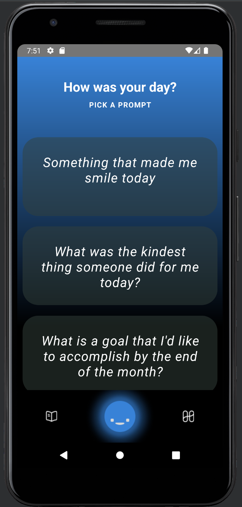
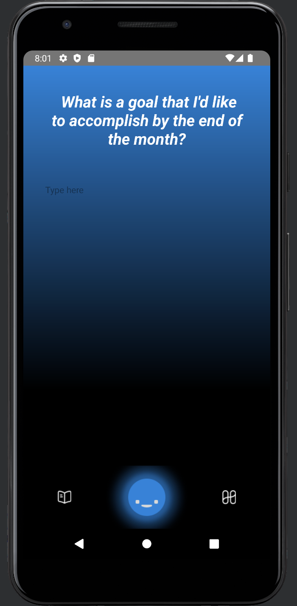
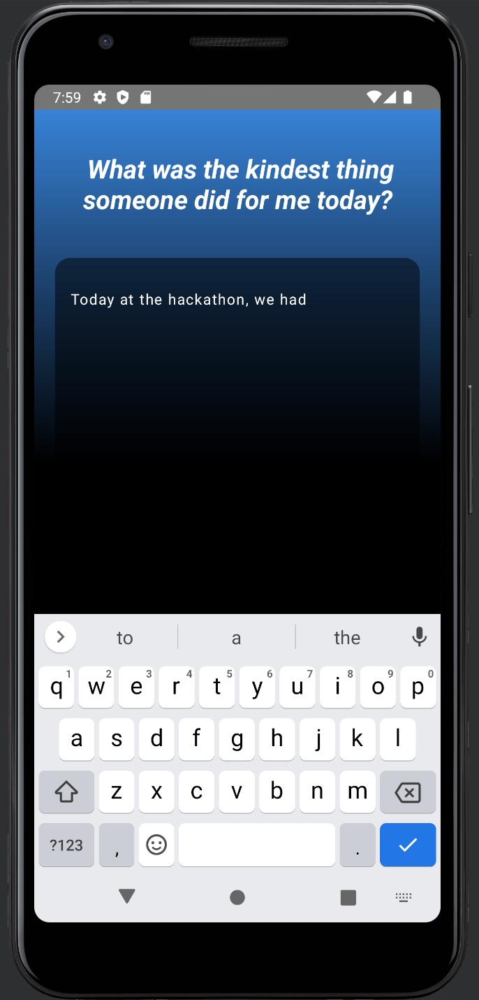
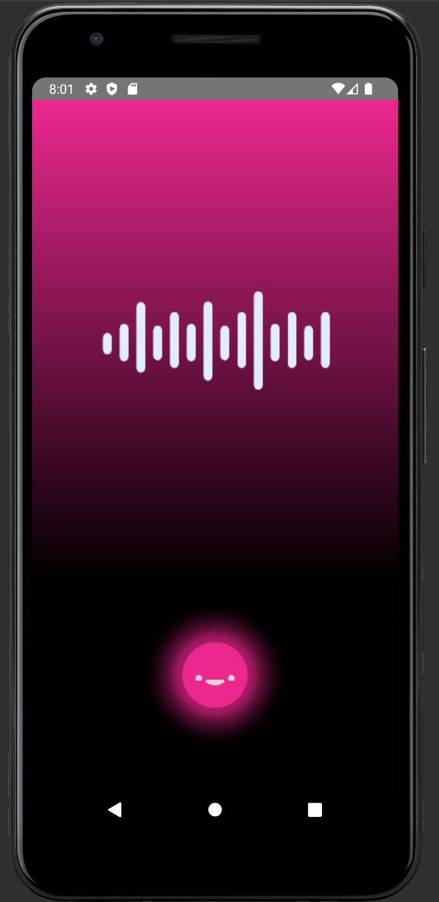
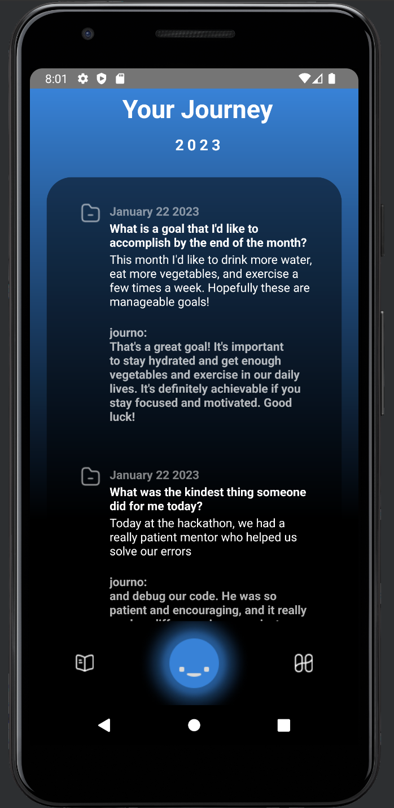
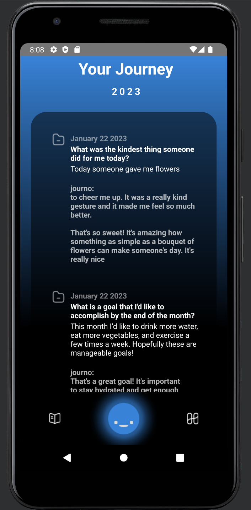

# journo

## an AI-powered journaling companion

[nwHacks 2023 Devpost](https://devpost.com/software/journo)

    

    
    
    
    

    
    

## Setup
1. Follow instructions at https://reactnative.dev/docs/environment-setup to set up a react native environment
1. `npm install` in the root directory
1. Open the `android` directory in Android Studio and sync gradle
1. `npx react-native start` / `react-native run-android` 

## Optional ChatGTP Integration
1. Follow instructions in TextProcessor.ts
